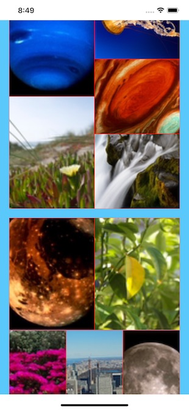

# Digest

Sample app that demonstrates UICollectionViewCompositionalLayout creating a mosaic-style layout which also contains a scrolling section. This is new in iOS 13 and requires Xcode 11. Swift.

Several years ago I worked on an app that called this type of layout a digest, so named in its honor. It was a LOT of work. UICollectionViewCompositionalLayout makes this type of layout a breeze. Very nice. WWDC 2019 session 215 is an excellent overview.

***

### View with two sections which have different layouts. Again, really easy to do.

***

## License

Digest is licensed under the MIT License. See the LICENSE file for more information, but basically this is sample code and you can do whatever you want with it.